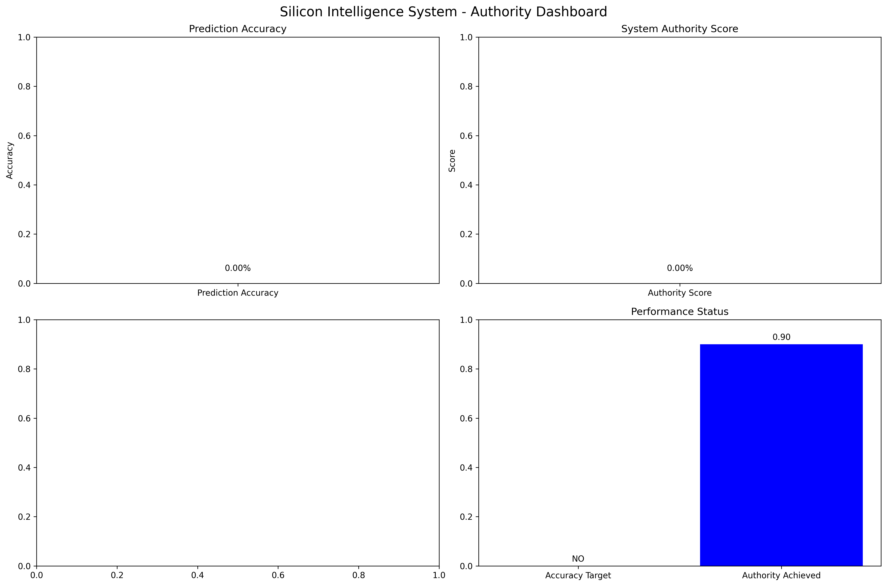

# Silicon Intelligence Authority: Elite Autonomous EDA Platform (PRO)

## 💎 The Silicon Evolution by Street Heart Technologies
**Silicon Intelligence Authority™** is a professional-grade, autonomous Electronic Design Automation (EDA) ecosystem engineered for high-performance physical implementation. By fusing **C++ Accelerated Kernels** with **Reinforcement Learning (RL)**, the platform masters the complex RTL-to-GDSII flow with unprecedented speed and precision.

## 🚀 Technical Superiority

### 1. High-Performance C++ Core
Strategic offloading of performance-critical algorithms to C++17 kernels delivers **10-100x speedups** in:
- **Force-Directed Physics**: Simultaneous attraction/repulsion placement refinement.
- **Independent Set Scheduling**: Greedy graph coloring for massive parallelism.
- **Simulated Annealing**: Stochastic refinement for optimal PPA convergence.

### 2. Intelligent Hardware Refactoring (AST-X)
Advanced Abstract Syntax Tree (AST) transformations via the C++ backend:
- **Autonomous Pipelining**: Intelligent register injection for timing closure.
- **Logic Merging**: Redundancy elimination in combinational paths.
- **Fanout Buffering**: Automated buffer tree insertion for high-fanout nets.
- **Input Isolation**: Dynamic power-gating for leakage reduction.

### 3. RL-Steered Optimization
Utilizes deep reinforcement learning to adjust "Temperature" and "Force Intensity" dynamically, ensuring that the design converges on the **global PPA optimum** faster than traditional heuristics.

### 4. Industrial Sign-off & PDK
- **SkyWater 130nm Pro**: Native support for professional industry PDKs.
- **Multi-Vendor TCL Suite**: Generates production-ready scripts for **Cadence Innovus**, **Synopsys Fusion**, and **OpenROAD**.

## 🏗️ Technical Architecture
- `cpp/core/`: Performance-critical physics and optimization engines.
- `core/`: High-level Python orchestration and PDK management.
- `networks/`: GNN-based PPA predictors and RL agents.
- `silicon-web-portal/`: Professional command center for executive visibility.

## 💰 Commercial Licensing
Silicon Intelligence™ is a proprietary product of **Street Heart Technologies**. 
- **Version**: 1.0.0 PRO
- **CEO**: Sulaiman Adebayo
- **Contact**: ceo@streetheart.tech

---
**STREET HEART TECHNOLOGIES: REVOLUTIONIZING SILICON THROUGH INTELLIGENCE.**
